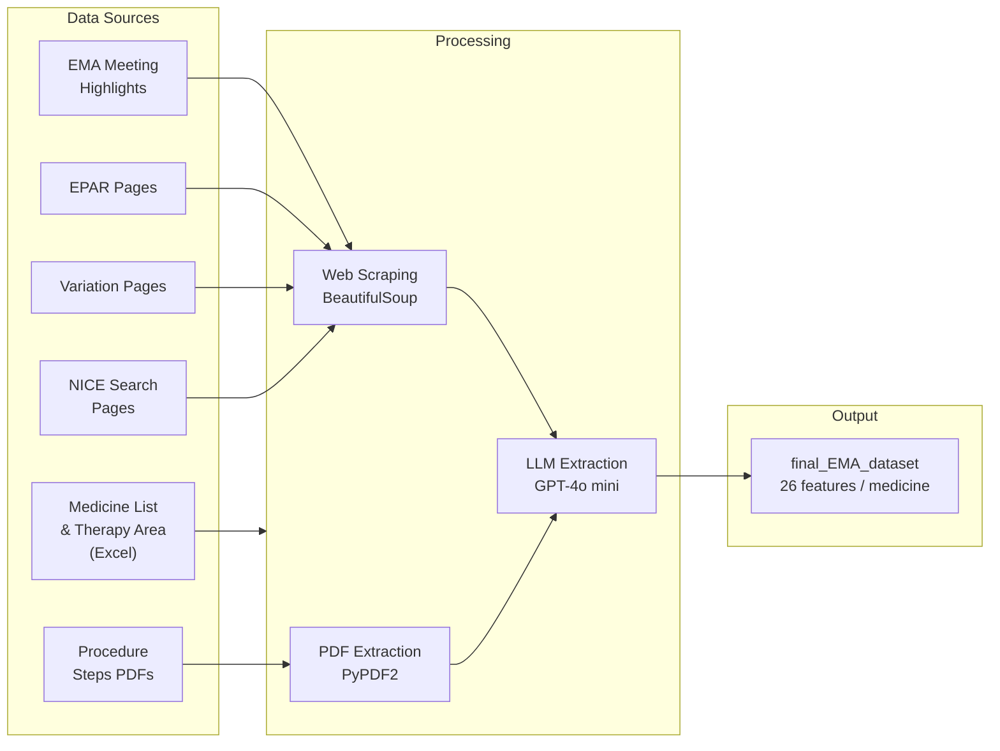

# Automated EMA & NICE Data Scraping


Automated pipeline for building a structured regulatory and HTA (Health Technology Assessment) database on medicines, by combining web scraping and LLM-based extraction from [EMA](https://www.ema.europa.eu) and [NICE](https://www.nice.org.uk).

---

## Pipeline



---

## Output Dataset

Each row represents one medicine from the latest CHMP Meeting Highlights. 26 features are collected per medicine across four categories.

### Identification

| Feature | Description | Source |
|---|---|---|
| `Product Name` | Brand name | CHMP Meeting Highlights |
| `INN` | Molecule (international non-proprietary name) | CHMP Meeting Highlights |
| `Marketing authorisation holder` | Company name | CHMP Meeting Highlights |
| `epar_url` | Link to EPAR page | Generated from product name |
| `variation_url` | Link to variation page | Scraped from CHMP news |
| `MH_url` | Link to Meeting Highlights news | CHMP Meeting Highlights |

### Clinical

| Feature | Description | Source |
|---|---|---|
| `Full Indication` | Full therapeutic indication (LLM-extracted) | EPAR page |
| `New indication HTML` | Newly added indication shown in **bold** (LLM-extracted) | Variation page |
| `New indication PDF` | Most recently added indication (LLM-extracted) | Procedure steps PDF |
| `Removed indication HTML` | Removed indication shown in ~~strikethrough~~ (LLM-extracted) | Variation page |
| `Therapy class` | ATC code (first 3 characters) | EPAR page or medicine list |
| `Therapy Area` | Mapped therapy area | Therapy area lookup table |
| `Cancer` | Whether oncology drug (L01/L02) | Derived from therapy class |
| `Orphan` | Orphan medicine designation | EMA medicine list |

### Regulatory Dates

| Feature | Description | Source |
|---|---|---|
| `Initial Approval` | Initial approval or extension of indication | CHMP Meeting Highlights |
| `CHMP Opinion Date` | Last day of CHMP meeting | CHMP Meeting Highlights |
| `Decision date` | European Commission decision date | EMA medicine list |
| `EMA date for extension` | Date of most recent extension (LLM-extracted) | Procedure steps PDF |
| `title` | Title of CHMP Meeting Highlights news | CHMP Meeting Highlights |
| `date` | Date of CHMP Meeting Highlights news | CHMP Meeting Highlights |

### NICE Comparison

| Feature | Description | Source |
|---|---|---|
| `Search Result in NICE` | Whether medicine appears in NICE search | NICE search page |
| `NICE_url` | NICE search URL for the medicine | Generated from INN |
| `Full Indication Similarity` | Similarity between EMA full indication and NICE text (LLM-scored) | NICE page + EMA |
| `New Indication HTML Similarity` | Similarity between new indication (HTML) and NICE text (LLM-scored) | NICE page + EMA |
| `New Indication PDF Similarity` | Similarity between new indication (PDF) and NICE text (LLM-scored) | NICE page + EMA |

---

## Project Structure

```
├── notebooks/
│   └── EMA_data_scraping.ipynb   # Main notebook (Google Colab)
├── scripts/
│   ├── config.py                 # Shared config: HTTP headers, OpenAI client
│   ├── scrape_data_fromEPAR.py   # EPAR page scraper
│   ├── scrape_data_fromNICE.py   # NICE search scraper
│   ├── scrape_data_fromMH_with_LLM.py  # Meeting Highlights + LLM pipeline
│   ├── scrape_data_fromSHEET.py  # Medicine list lookup
│   ├── scrape_therapy_area.py    # Therapy area lookup
│   ├── process_medicines_and_get_indications.py
│   ├── process_medicines_and_new_indications_html.py
│   ├── process_medicines_and_removed_indications_html.py
│   ├── query_model_for_indication.py
│   ├── query_model_for_new_indication_html.py
│   ├── query_model_for_removed_indication_html.py
│   ├── query_model_for_new_indication_pdf.py
│   ├── query_model_for_ema_date.py
│   ├── query_model_for_NICE_similarity.py
│   ├── compare_nice_and_indication.py
│   ├── extract_text_from_pdf.py
│   ├── text_fromNICE.py
│   └── get_chmp_opinion_date.py
├── data/
│   ├── medicines_output_medicines_en.xlsx   # EMA medicine list
│   └── therapy_area.xlsx                   # Therapy area lookup table
└── results/
    └── final_EMA_dataset.xlsx              # Output dataset
```

---

## Objectives

- Build a consistent database of regulatory and HTA guidance on medicines for analysis and statistics.
- Focus on stepwise data collection and automation from EMA and NICE sources.

## AI Utilization

- **Model**: GPT-4o mini — chosen for efficiency and cost-effectiveness over Llama 3.1.
- **Tasks**: Extracts structured data from unstructured sources — HTML (bold/strikethrough text), PDFs (procedure steps), and NICE web pages (indication similarity scoring).
- **Output**: Structured Excel/CSV file with 26 features per medicine for downstream analysis.
